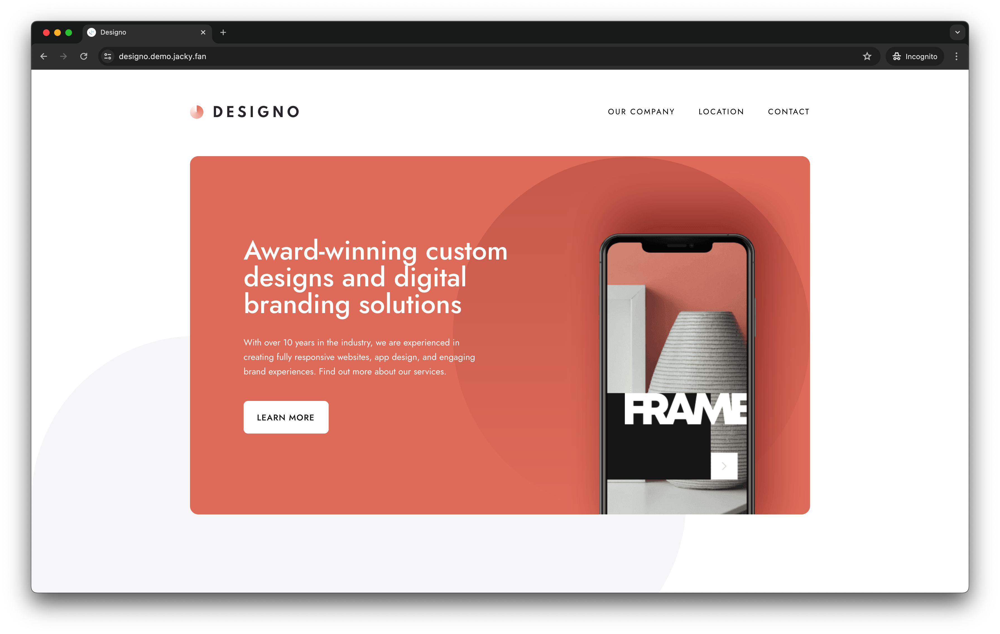
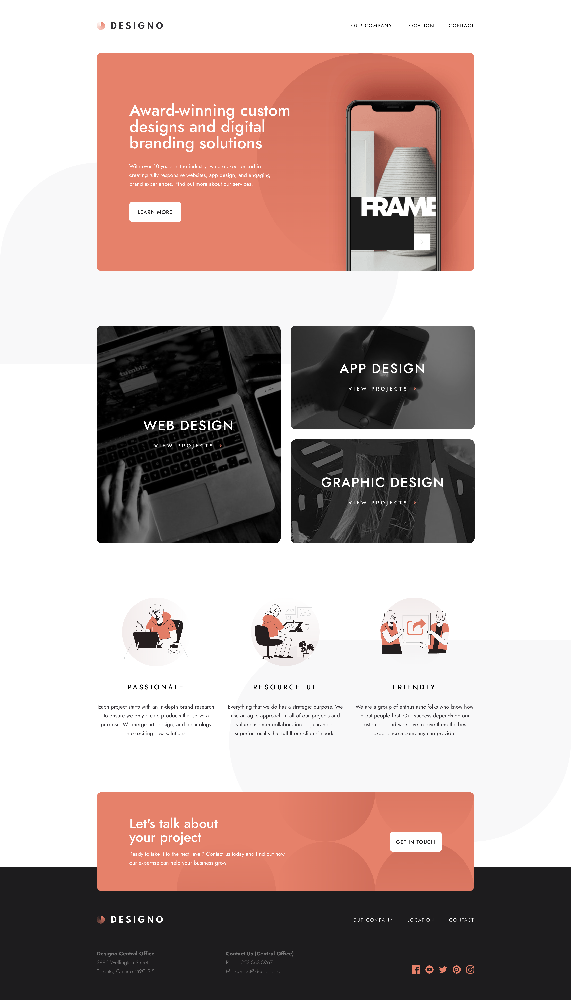
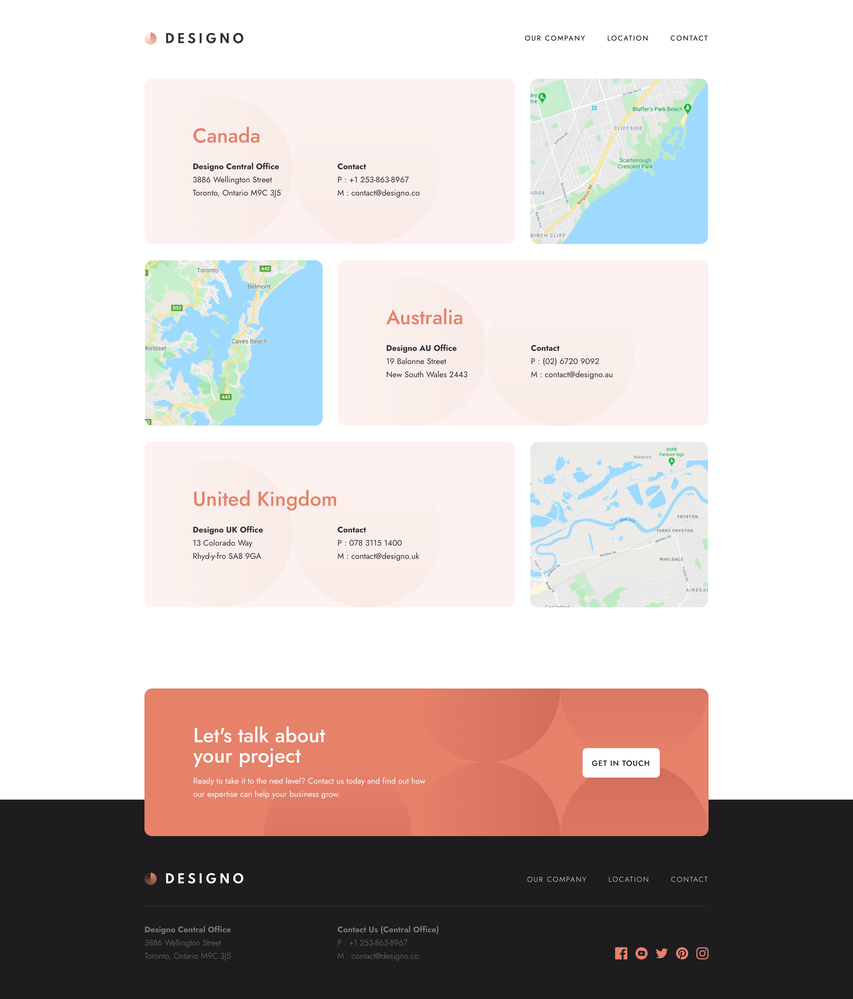
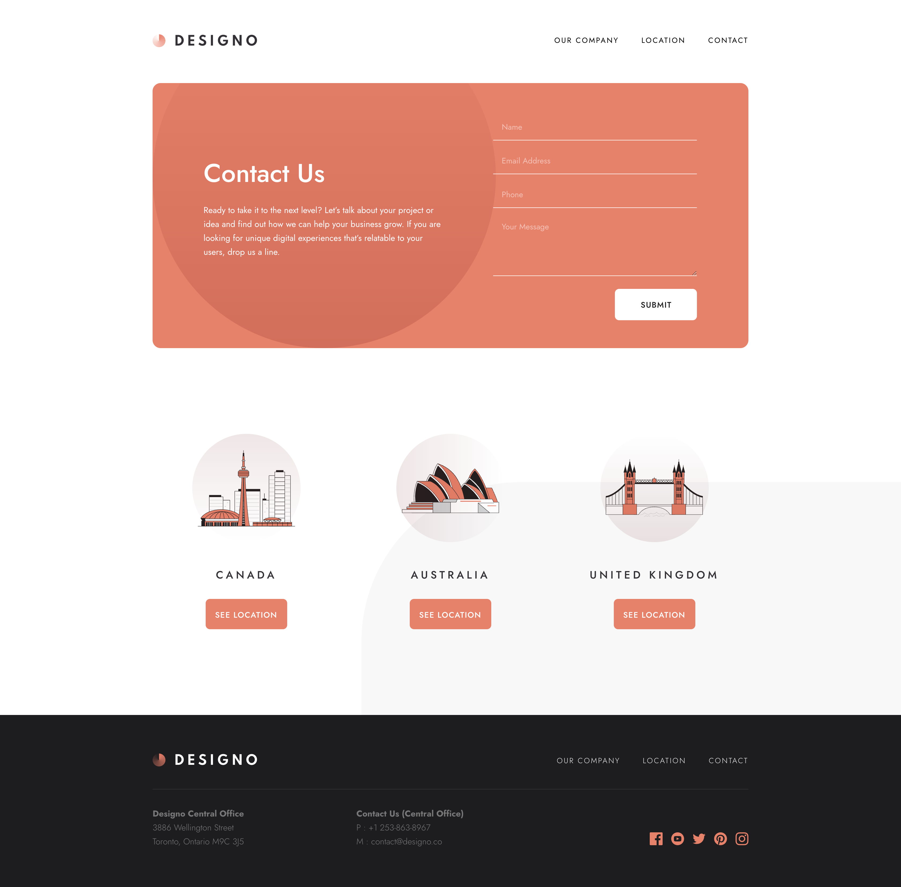
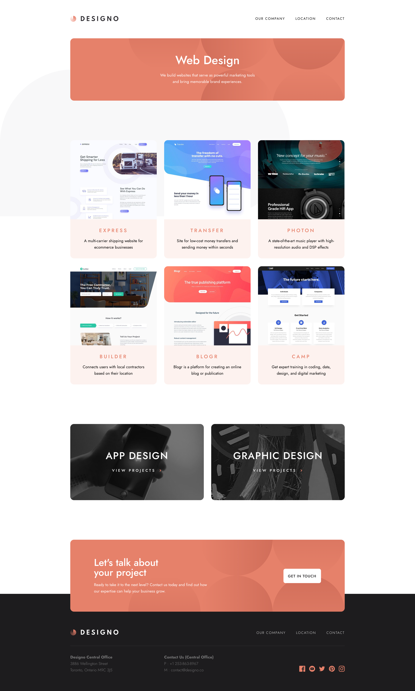
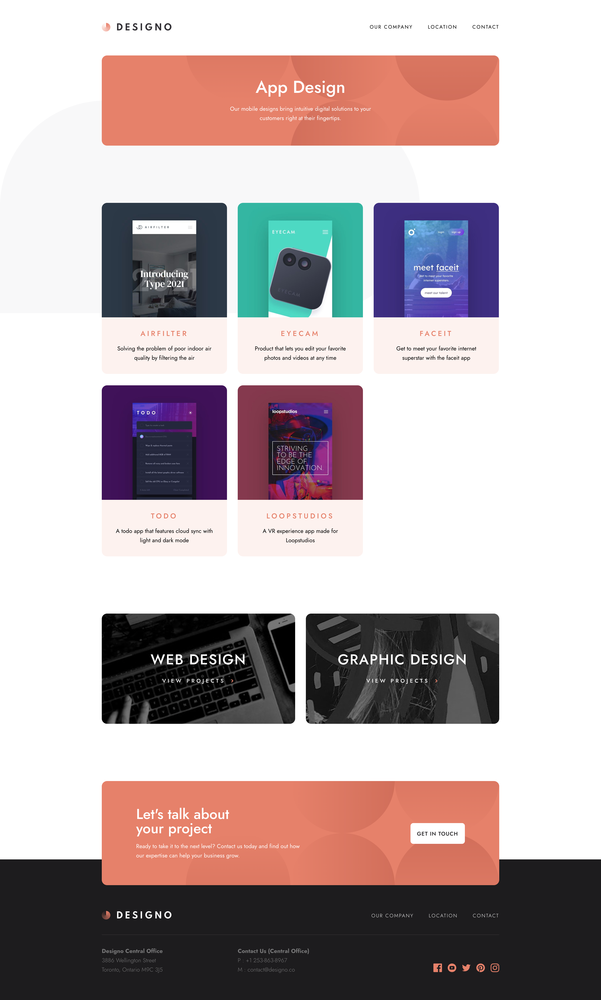
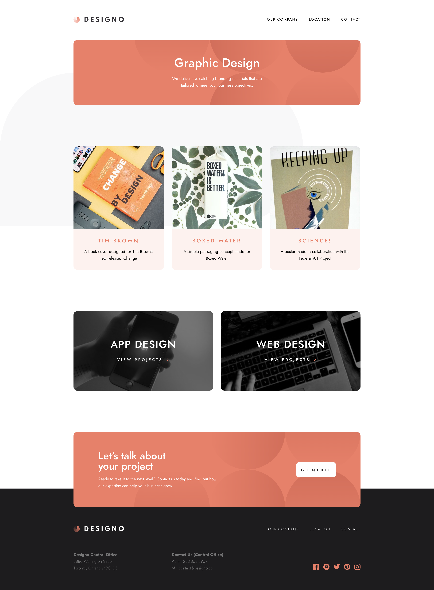

[](https://wakatime.com/badge/user/2cbd8003-b8b8-4565-92d7-ad9c23ff1846/project/153b6d55-e088-43d7-ac3c-b0562ba961d0)

This is a multi-page website built with Next.js, TypeScript and integrated with Strapi CMS. It is part of a code challenge from [Frontend Mentor](https://www.frontendmentor.io/challenges/designo-multipage-website-G48K6rfUT).

This repo is the frontend part of the project. The backend part is in [this repo](https://github.com/redfrogsss/designo-multipage-website-backend).



## Getting Started

First, run the development server:

```bash
npm run dev
# or
yarn dev
# or
pnpm dev
# or
bun dev
```

Open [http://localhost:3000](http://localhost:3000) with your browser to see the result.

You can start editing the page by modifying `app/page.tsx`. The page auto-updates as you edit the file.

This project uses [`next/font`](https://nextjs.org/docs/basic-features/font-optimization) to automatically optimize and load Inter, a custom Google Font.

## Learn More

To learn more about Next.js, take a look at the following resources:

- [Next.js Documentation](https://nextjs.org/docs) - learn about Next.js features and API.
- [Learn Next.js](https://nextjs.org/learn) - an interactive Next.js tutorial.

You can check out [the Next.js GitHub repository](https://github.com/vercel/next.js/) - your feedback and contributions are welcome!

## Screenshots from my work

### Home


### About


### Locations


### Contact


## Web Design


## App Design


## Graphic Design
